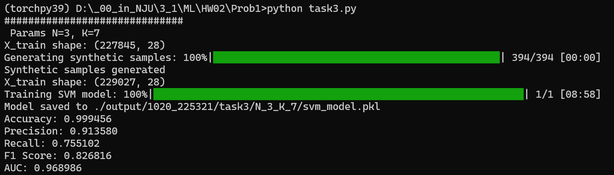
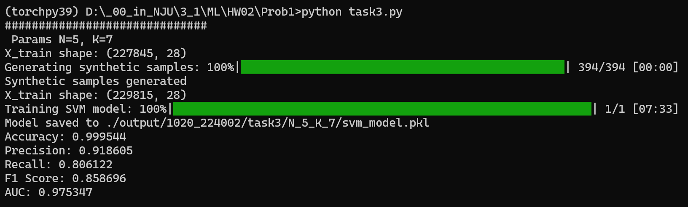
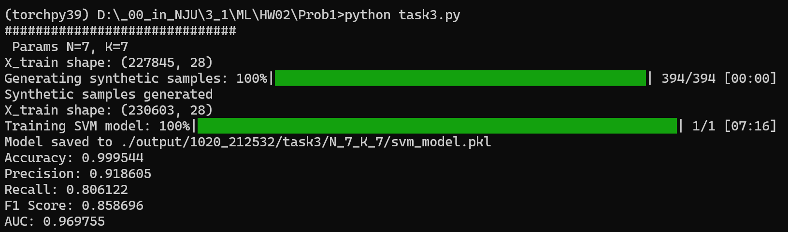
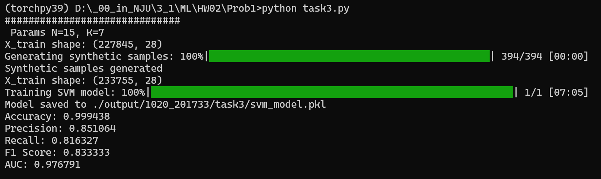
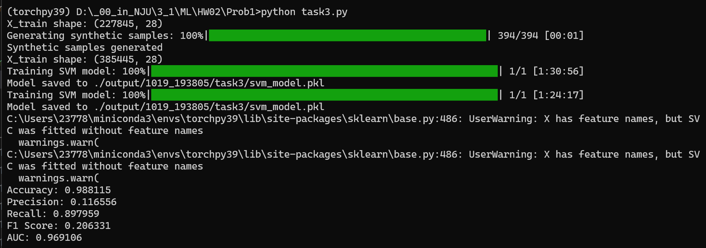

# Prob1 Code

这一大题我们设置的随机种子为14;

## 文件解释

[main.py](./main.py) 

里面有`train`和`test`两个函数，对task1-3进行训练和测试

[task1.py](task1.py) 完成第一小问的代码\
[task2.py](task2.py) 完成第二小问的代码\
[task3.py](task3.py) 完成第三小问的代码\
[utils.py](./utils.py) 辅助函数\
[model.py](./model.py) 支持向量机的模型\
[dataloader.py](./dataloader.py) 数据输入处理

[try_SMOTE.py](./try_SMOTE.py) 一个简单的尝试，可以忽略


## 运行

```js
python main.py --mode test --out_dir ./test --model_dir ./model/rand_seed_14

解释：
mode: "train" or "test", default "train"
out_dir: <yout out_dir 相对于"./output">, default datetime.now().strftime("%m%d_%H%M%S")
model_dir: <your model_dir>,仅mode为test时生效,default ./model/rand_seed_14
```
## 补充

由于 需要绘制ROC图，我们需要预测的Prob而不仅仅是Pred，据官方文档说，`probability=True`时的`train / fix`的时间会更长。

我的task1-2训练时间一般为9-12分钟。
很有趣的一点是N=K附近的时候过采样的时间会变低(但是也有可能是和python的pycache有关系，没有做相关性分析)
但是task3过采样在N很大的时候会更长的问题确实存在：
N=3

N=5

N=7

N=15

N=30

N=50

N=100

N=200

N=400 (为什么有两次是因为我手贱写了两行`train`)
